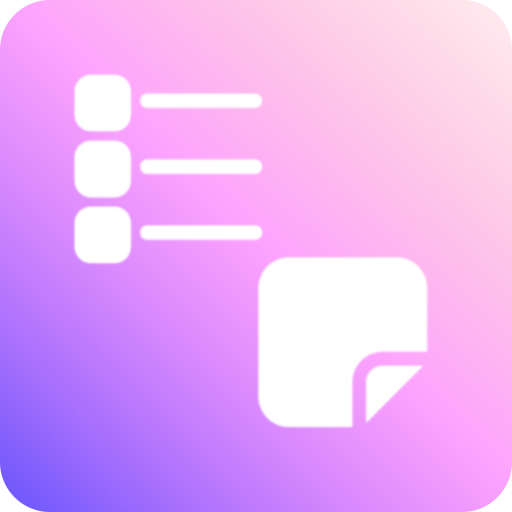
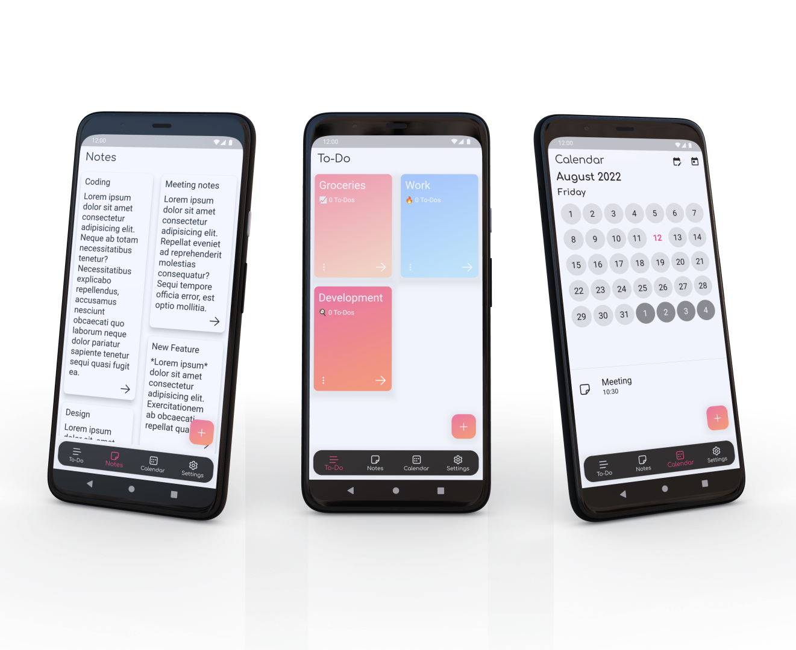
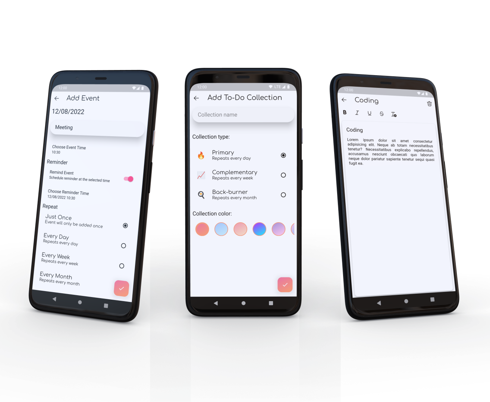
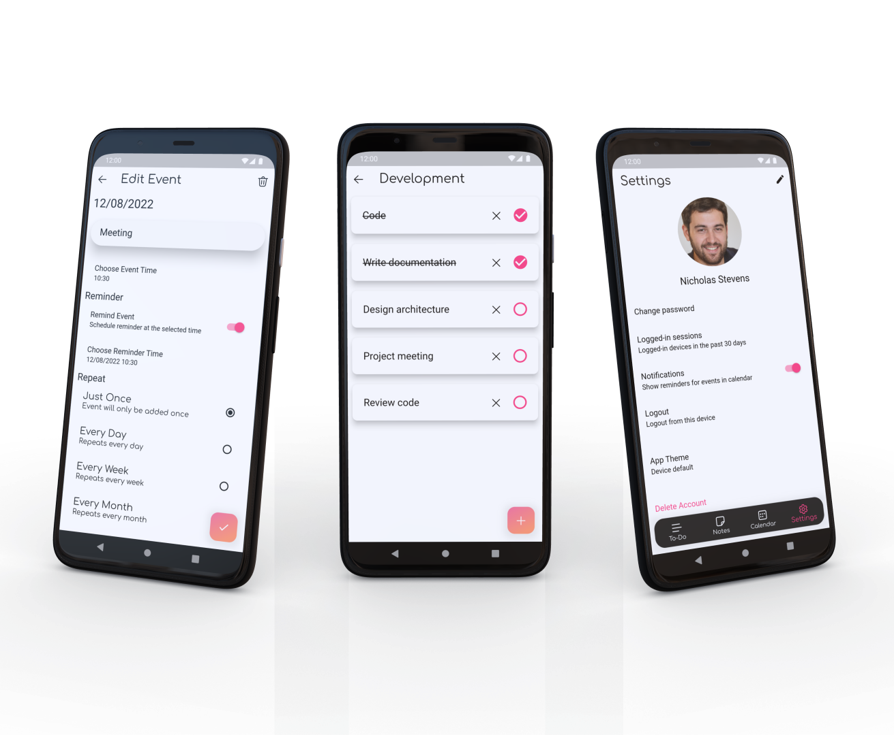
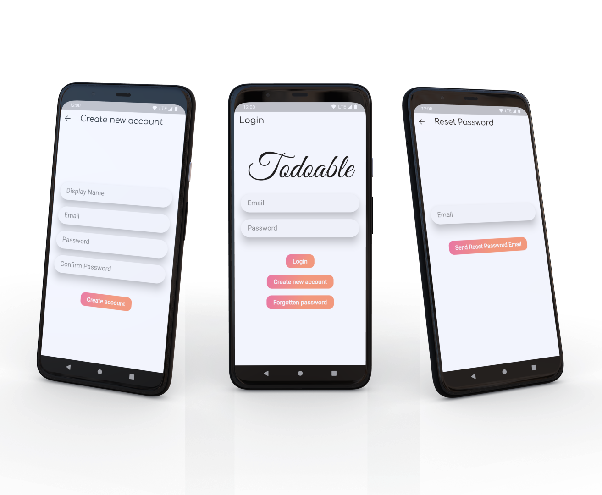
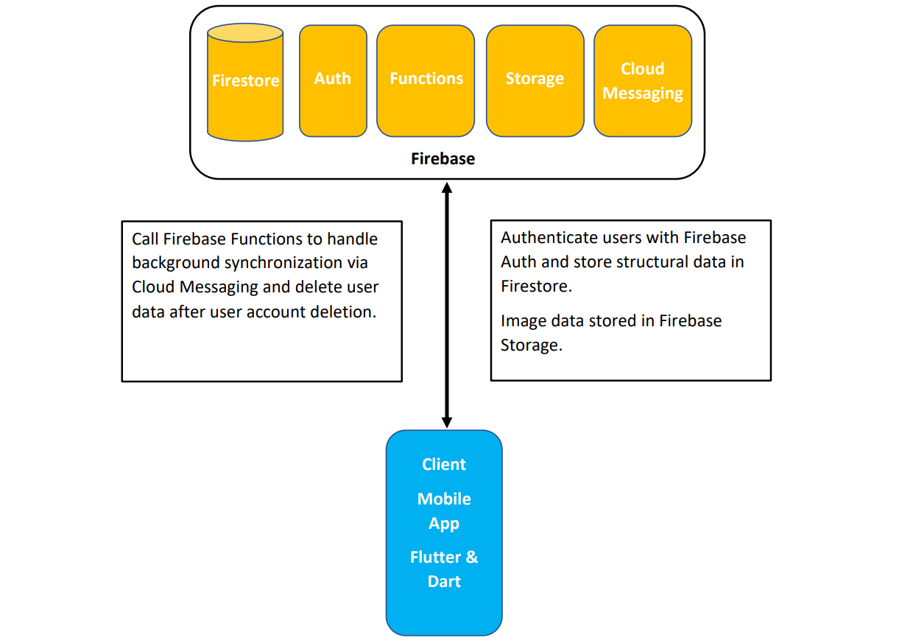

# Todoable - Time Management App

## Overview

Todoable - portfolio project application for managing tasks

## Functionality

 - User login and account management
 - Create Todo Collections with Todo lists
 - Notes with basic text formatting
 - Calendar with reminders, notifications and background synchronization
 - App Theming - Light & Dark theme

## Technology
 - Flutter & Dart - Mobile app
 - Firebase - Backend - Authentication, Functions, Firestore - Structural data storage, Firebase Storage - image data storage, Firebase Cloud Messaging - background synchronization

## Showcase

### Notes, Todo Collections and Calendar page

### Add Calendar Event, Add Todo Collection and Note page

### Edit Calendar Event, Todo List and Settings page

### Create new Account, Login and Reset Password page

## Architecture

Overview of the app's architercture

## Author

[Adam Soták](https://github.com/AdamSotak)

## Acknowledgments

 - In-App images and names - https://thispersondoesnotexist.com/ & https://randomuser.me/